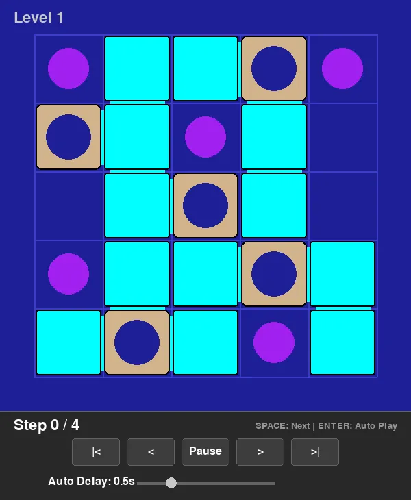

# Cats and Boxes Solver

An automated solver and graphical interface for the **"Cats and Boxes"** puzzle by **SmartGames**.

## Project Overview

This project provides a complete suite of tools to model, solve, and visualize the Cats and Boxes sequential movement puzzle. It includes an optimized solver, a graphical user interface for playback, an interactive level editor, and batch export capabilities.

## Executables & Commands

### 1. Solver (`solver.py`)
Finds the shortest sequence of moves to solve a given level.
- **Run with GUI playback:** `python3 solver.py 01`
- **Run with Autoplay:** `python3 solver.py 01 --autoplay`
- **Run in CLI mode (text only):** `python3 solver.py 01 --cli`

### 2. Level Editor (`editor.py`)
Create or modify puzzle levels using a mouse-driven interface.
- **Usage:** `python3 editor.py 32`
- **Controls:** 
  - **Left Click:** Select from palette / Place on grid.
  - **Right Click / 'R':** Rotate selected piece.
  - **'S':** Save to `questions/XX.txt`.
  - **ESC:** Deselect.

### 3. Edit and Solve Script (`edit_and_solve.sh`)
Streamlined workflow to edit a level and immediately see its solution.
- **Usage:** `./edit_and_solve.sh 32`

### 4. WebP Exporter (`webp_export.py`)
Renders a solution path into an optimized animated WebP file.
- **Usage:** `python3 webp_export.py 01`
- **Output:** Saved to `solution/01.webp`.

### 5. Batch Exporter (`batch_export.py`)
Automatically exports all missing solutions in parallel.
- **Usage:** `python3 batch_export.py -p 10`
- **Flag:** `-p` sets the level of parallelism (default: 10).

## Core Components

- **`board.py`**: The underlying engine that handles piece geometry, rotation, grid state, and move validation using NumPy.
- **`ui.py`**: A shared rendering module using Pygame for smooth animations and consistent visuals across all tools.
- **`board_parser.py`**: Translates ASCII puzzle representations into functional board objects.

## Technical Highlights
- **Optimized BFS**: Finds the shortest path using a prioritized search space.
- **Fast Grid Computation**: Leverages NumPy for efficient overlap and capture checks.
- **Minimal Mode**: Specialized rendering for high-efficiency recording.
- **Smooth Animations**: High-framerate interpolation for both translation and rotation of pieces.
